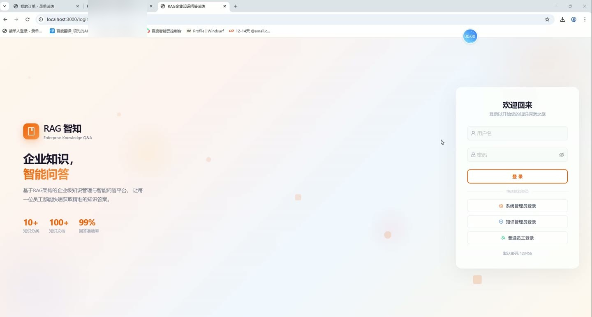
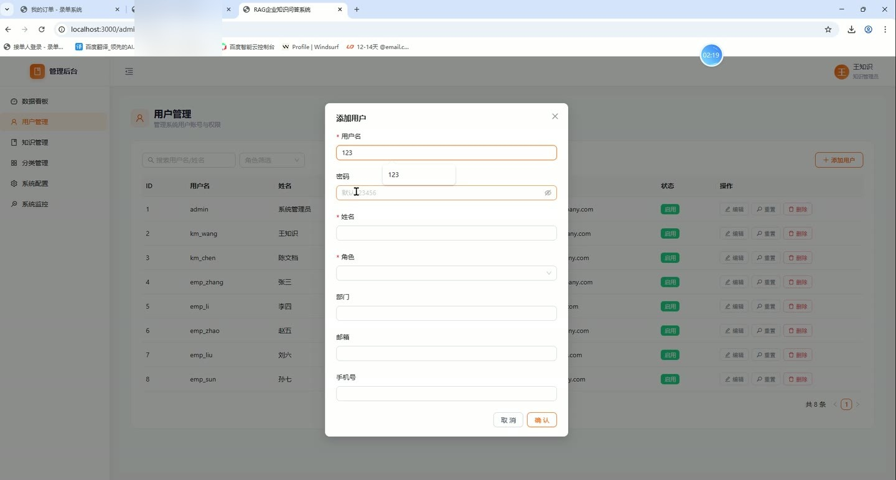
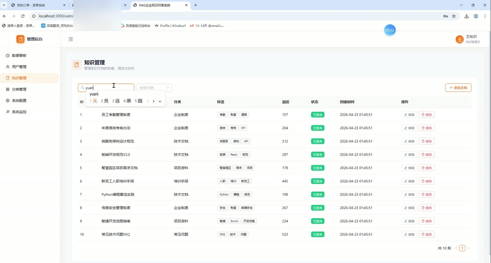
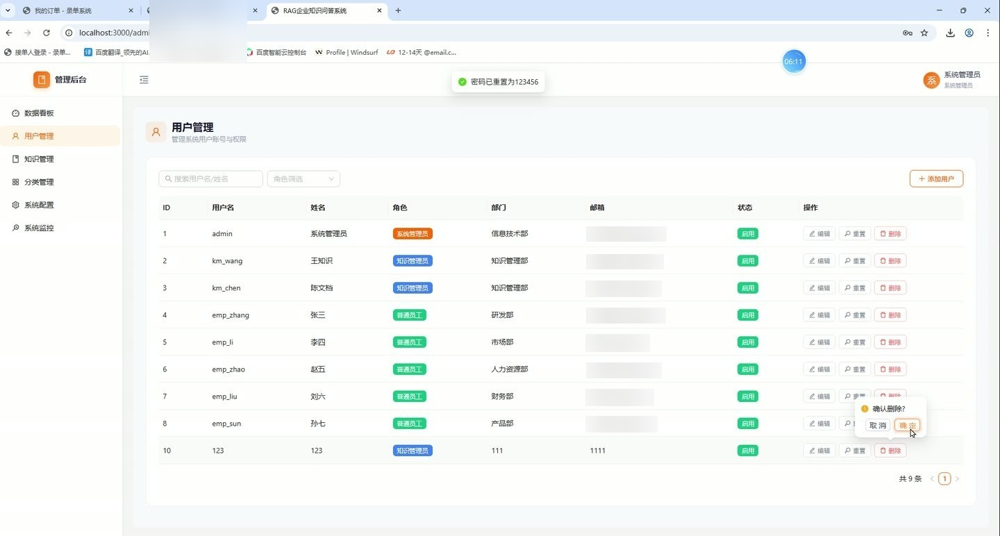
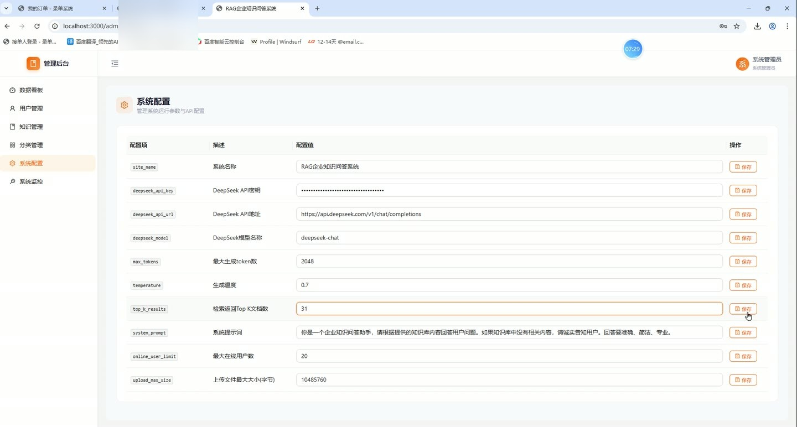
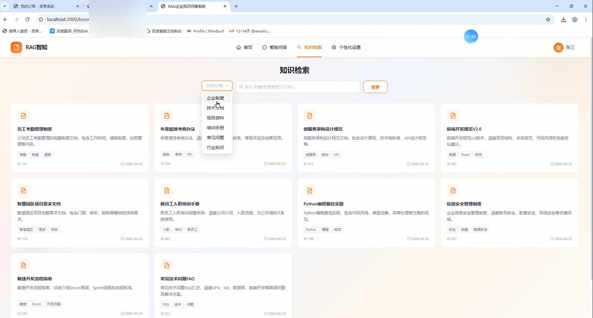

# (附文档)Python+Flask+React 基于 RAG 架构的企业内部知识问答系统

**技术栈**：Python、Flask、React18、MySQL

### 系统简介

本系统是一套基于 RAG 架构的企业内部知识问答平台，采用前后端分离架构，后端使用 Python Flask 提供 RESTful 接口，前端使用 React18 构建单页应用，数据存储于 MySQL。系统内置普通用户端、知识管理员端、系统管理员端三类角色，围绕知识文档管理与智能问答两条主线展开，支持 DeepSeek 大模型接入与知识库检索增强生成。
 
### 核心功能
 
### 普通用户端

 
- 账号登录：输入用户名与密码完成登录，登录成功后本地保存令牌，后续请求自动携带 Authorization 头。 
- 首页浏览：展示系统概览信息，作为进入问答与知识检索的入口。 
- 智能问答：在对话页输入问题，系统调用 DeepSeek 接口结合知识库内容生成回答，支持多轮连续对话。 
- 会话管理：新建问答会话、查看历史会话列表、查看指定会话下的全部消息记录、删除不需要的会话。 
- 来源追溯：每条助手回答附带来源文档 ID 列表，可据此定位引用的知识文档。 
- 知识检索：按关键词搜索知识文档，支持列表展示与关键词匹配结果。 
- 文档详情：查看知识文档的标题、正文内容、摘要、标签、封面图与浏览次数。 
- 分类浏览：按企业制度、技术文档、项目资料、培训手册、常见问题、行业知识等分类查看文档。 
- 个人设置：查看与维护本人真实姓名、邮箱、手机号、部门、头像等资料。 
- 消息渲染：助手回答支持 Markdown 格式渲染，便于展示列表、代码块等结构化内容。
 
### 知识管理员端

 
- 文档列表管理：分页查看知识文档，支持按分类、状态等条件筛选。 
- 新增文档：填写标题、正文内容、摘要、分类、标签、封面图，并可上传附件文件。 
- 编辑文档：修改已有文档的标题、内容、摘要、分类、标签、封面与附件。 
- 删除文档：移除不再需要的知识文档记录。 
- 文档状态控制：设置文档为草稿、已发布或已归档状态，控制前台可见性。 
- 分类管理：新增知识分类，填写分类名称、描述、图标与排序值。 
- 分类编辑与删除：修改分类信息或删除无用分类。 
- 分类排序：通过 sort_order 字段调整分类在前台的展示顺序。 
- 文件上传：上传文档附件与封面图片，单文件大小上限 10MB。 
- 知识统计：查看知识库文档数量、分类分布等统计数据。
 
### 系统管理员端

 
- 数据看板：查看系统整体运行数据，包括用户量、文档量、问答量等指标。 
- 用户列表：分页查看全部用户，支持按条件筛选。 
- 新增用户：创建用户并设置用户名、密码、真实姓名、邮箱、手机号、角色、部门。 
- 编辑用户：修改用户资料与所属部门、角色信息。 
- 删除用户：移除系统中的用户账号。 
- 重置密码：将指定用户密码重置为默认值。 
- 角色分配：为用户分配 admin、knowledge_admin、employee 三类角色之一。 
- 状态管理：启用或禁用用户账号，控制其登录权限。 
- 系统配置：查看并修改站点名称、DeepSeek API 密钥与地址、模型名称、最大 token 数、生成温度、Top K 检索数、系统提示词、在线用户上限、上传大小限制等参数。 
- 监控日志：分页查看系统操作日志，包含操作类型、详情、响应时间、IP 地址与操作时间。
 
### 技术栈

 后端语言Python 后端框架Flask ORMFlask-SQLAlchemy 跨域处理Flask-CORS 数据库MySQL 8.0（utf8mb4） 数据库驱动PyMySQL 前端框架React 18 路由方案react-router-dom v6 UI 组件库Ant Design 5 HTTP 客户端Axios 图表库Recharts Markdown 渲染react-markdown 构建工具react-scripts（Create React App） 大模型服务DeepSeek Chat API
 
### 交付内容

 
- 后端完整源码 
- 前端完整源码 
- 数据库初始化脚本 
- 万字文档

## 界面展示

---

## 获取完整源码 + 万字文档

本仓库为项目介绍页。**完整前后端源码、数据库初始化脚本、万字项目文档**，请加微信 `kangkangcode`，或访问 [codekk.top](http://codekk.top) 获取。

可作课程设计 / 毕业设计参考，支持远程部署调试。